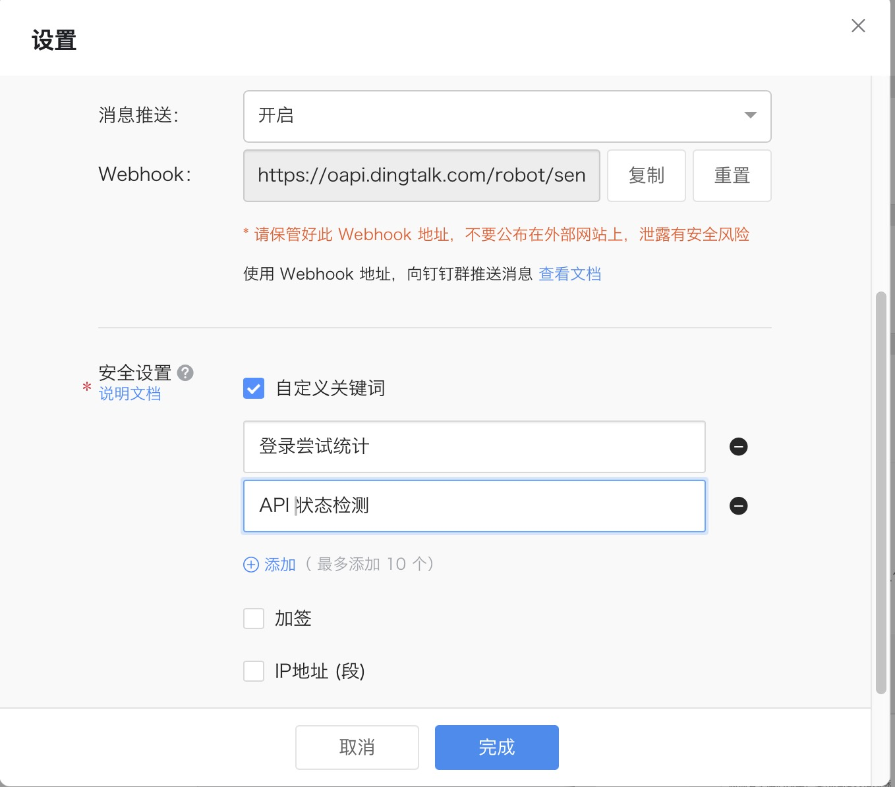

# PhishLog

PhishLog是一个用于记录和分析钓鱼网站登录尝试的工具，帮助安全研究人员收集和统计受害者的行为数据。

## 功能特点

- 模拟登录接口，记录用户名、密码和IP信息
- 自动统计分析登录尝试数据
- 支持标准化用户名匹配相似账号
- 生成CSV格式报告
- 通过钉钉机器人发送统计报告
- 支持定时任务自动执行统计分析

## 系统组件

- `back_api.py` - Flask后端服务，提供模拟登录API及数据记录功能
- `stats.py` - 统计分析脚本，处理日志数据并生成报告，支持多种输出格式
- `dd_run.py` - 定时任务调度器，定期执行统计分析并推送结果
- `login_attempts.log` - 记录所有登录尝试的日志文件，包含时间戳、IP、账号和密码信息
- `stats.csv` - 统计结果输出文件，包含账号、尝试次数、时间范围等信息
- `config.template.py` - 配置文件模板，包含所有可配置项的示例
- `config.py` - 本地配置文件(需自行创建)

## 安装说明

1. 下载项目到本地


2. 安装依赖
   ```
   pip install -r requirements.txt
   ```

3. 创建配置文件
   ```
   cp config.template.py config.py
   ```
   然后根据需要编辑 `config.py` 文件，填入正确的配置信息。

## 使用方法

### 配置说明

项目使用配置文件 `config.py` 管理所有敏感配置，包括：

- API服务配置（端口、地址、CORS设置等）
- 日志配置
- 钉钉机器人配置（webhook地址）
- 定时任务配置

### 钉钉机器人配置

要使用钉钉机器人功能，请按照以下步骤操作：

1. 在钉钉群中添加自定义机器人：
   - 打开钉钉群聊
   - 点击群设置 > 智能群助手 > 添加机器人 > 自定义
   - 设置机器人名称和头像
   - 安全设置中选择"加签"（推荐）或"自定义关键词"
   - 若选择关键词，请添加"PhishLog"作为关键词
   - 复制生成的Webhook地址和选择"加签"

2. 配置项目文件：
   - 打开`config.py`文件
   - 设置`DINGTALK_WEBHOOK`为刚才获取的Webhook地址
   
3. 测试配置是否正确：
   ```
   python stats.py --dingtalk
   ```

配置示例参考图：



### 启动API服务

运行以下命令启动模拟登录API服务：

```
python back_api.py
```

服务默认在8090端口运行，可以通过浏览器访问 `http://your-server-ip:8090/` 。

### API接口说明

基础URL: `http://your-server-ip:8090/`

| 接口路径 | 方法 | 功能描述 | 参数 |
|---------|------|---------|------|
| `/login` | POST | 模拟登录验证 | username, password |
| `/health` | GET | 健康检查 | 无 |

### 手动执行统计分析

```
# 基本分析
python stats.py

# 详细信息
python stats.py --detail
python stats.py -d

# 生成CSV报告
python stats.py --csv
python stats.py -c

# 发送统计到钉钉
python stats.py --dingtalk
python stats.py -dd

# 仅分析今天的数据
python stats.py --today
python stats.py -t
```

### 启动定时任务

```
python dd_run.py
```

定时任务默认会在每天12:00和17:00自动执行统计分析并发送到钉钉群，可以在 `config.py` 中修改执行时间。

## 参数说明

### stats.py 参数

```
usage: stats.py [-h] [-d] [-c] [-dd] [-t] [--webhook WEBHOOK] [--title TITLE] [-v] [--no-normalize] [--check-api]
                [--api-url API_URL] [--log LOG] [--ignore IGNORE [IGNORE ...]]

分析登录尝试日志

optional arguments:
  -h, --help            show this help message and exit

主要功能:
  -d, --detail          在终端打印显示详细信息
  -c, --csv             生成CSV格式结果
  -dd, --dingtalk       开启钉钉消息推送功能
  -t, --today           只显示今日的登录尝试记录

钉钉推送配置:
  --webhook WEBHOOK     自定义钉钉机器人Webhook地址，不提供则使用默认地址
  --title TITLE         发送到钉钉的消息标题
  -v, --verbose         钉钉输出中显示详细信息

高级选项:
  --no-normalize        禁用用户名标准化
  --check-api           检查API健康状态
  --api-url API_URL     自定义API健康检查URL
  --log LOG             日志文件路径
  --ignore IGNORE [IGNORE ...]
                        要忽略的用户名列表，多个用户以空格分隔
```

## 常见问题

### 1. 如何更改API服务的端口?

在 `config.py` 文件中修改 `API_PORT` 参数：

```python
# API服务配置
API_HOST = '0.0.0.0'  # 监听所有网卡
API_PORT = 8080  # 修改为你需要的端口
```

### 2. 为什么钉钉机器人消息发送失败?

常见原因:
- Webhook地址配置错误
- 加签密钥未正确设置
- 消息内容不包含自定义关键词（如果使用关键词验证方式）
- 机器人每分钟发送消息数量超出限制（钉钉限制20条/分钟）


## 安全注意事项

- 本工具仅用于安全研究和教育目的
- 请勿用于非法活动
- 请遵守相关法律法规和网络安全政策

## 许可证

[MIT License](LICENSE) 